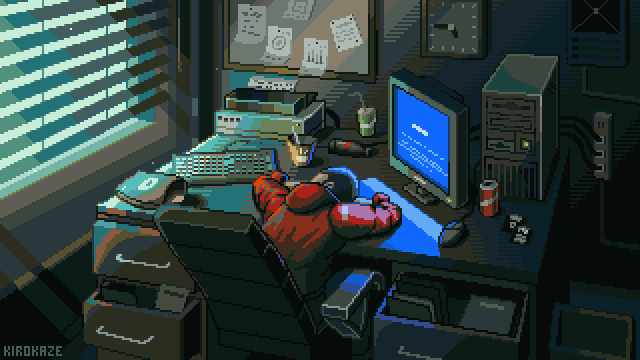

### Hi, I'm Yousef 
— you can also call me Joseph.

Over the past year, I’ve started my journey in frontend development. I began as an intern at a private company, and now I’m also working as a freelancer.

During this time, I’ve gained solid experience with modern frontend technologies, especially React and Next.js, and I enjoy building clean, responsive, and user-friendly web applications.

I’m always looking to improve my skills and take on new challenges in web development.

  

---

## 🏆 Badges

---

## 🚀 Languages

---

## ⚛️ Frameworks

---

## 🎨 Styling

---

## 🛠 Tools

---

## 💻 OS

---

## 💻 IDE

---

## 📬 Reach Me

## 📊 GitHub Stats

---

## 🔥 GitHub Streak

